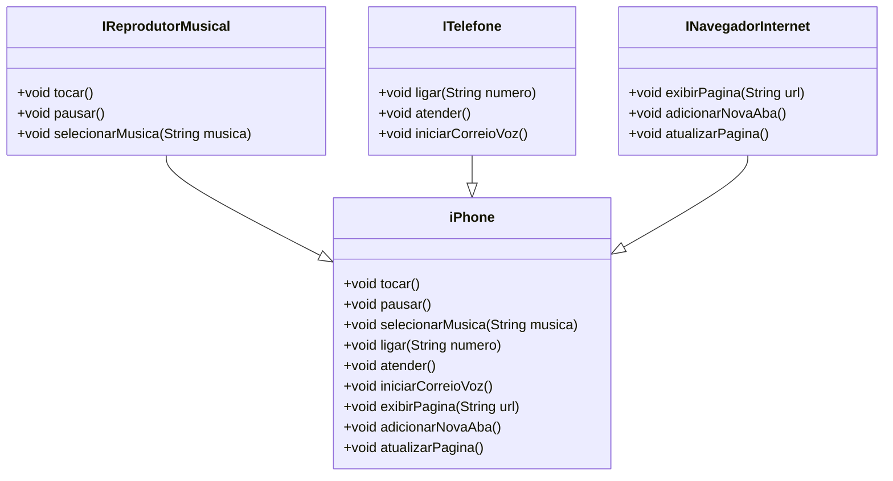

```mermaid
classDiagram
    class IReprodutorMusical {
        +void tocar()
        +void pausar()
        +void selecionarMusica(String musica)
    }

    class ITelefone {
        +void ligar(String numero)
        +void atender()
        +void iniciarCorreioVoz()
    }

    class INavegadorInternet {
        +void exibirPagina(String url)
        +void adicionarNovaAba()
        +void atualizarPagina()
    }

    class iPhone {
        +void tocar()
        +void pausar()
        +void selecionarMusica(String musica)
        +void ligar(String numero)
        +void atender()
        +void iniciarCorreioVoz()
        +void exibirPagina(String url)
        +void adicionarNovaAba()
        +void atualizarPagina()
    }

    IReprodutorMusical --|> iPhone
    ITelefone --|> iPhone
    INavegadorInternet --|> iPhone
```
